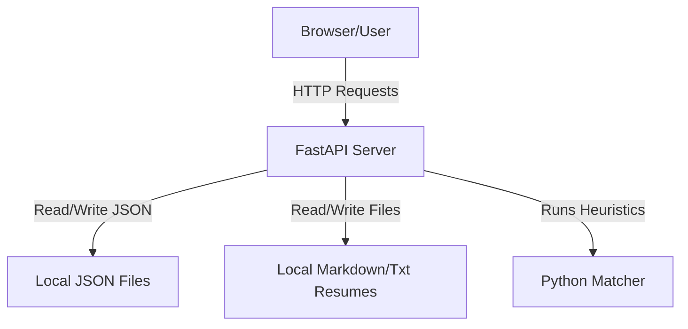

# Shortlist — System Architecture

This document describes the design and components of the **Shortlist** job-application command center.

## Overview

Shortlist is a web application with a FastAPI backend and a static HTML/JS/CSS frontend. It helps students evaluate job descriptions against their uploaded resumes and determines the level of fit (STRONG FIT, STRETCH, or SKIP) with verified citations.

## Backend Services (`main.py`)

The backend is built using **FastAPI** and **Uvicorn**.

### 1. Data Layer (No Database)
All data is stored in the local file system under the `data/` directory:
- **`data/users.json`**: Credentials and verification status of registered users.
- **`data/last_verification_code.txt`**: Logs the last generated 6-digit email verification code for easy retrieval during testing.
- **`data/resumes/<user_email>/`**: Folder containing all uploaded resume files (`.md`, `.txt`, `.pdf`) and an `active_resume.txt` pointer.
- **`data/applications/<user_email>.json`**: List of matched applications and status logs.
- **`data/settings/<user_email>.json`**: User preferences (tone, email notification checkbox status, etc.).

### 2. API Endpoints
- **Authentication**:
  - `POST /api/auth/signup`: Create a user with status `unverified` and generate a 6-digit code.
  - `POST /api/auth/verify`: Match code to mark user as `verified`.
  - `POST /api/auth/login`: Authenticate verified users.
- **Resume Management**:
  - `POST /api/resumes/upload`: Upload a new resume to local file storage. If the file is a PDF, extracts clean text on-the-fly to prevent file corruption when syncing to the Lemma pod.
  - `GET /api/resumes`: Retrieve all user resumes and the active resume.
  - `POST /api/resumes/active`: Mark a resume as active.
  - `DELETE /api/resumes/{filename}`: Delete a resume file.
- **Matching & Applications**:
  - `POST /api/applications/match`: Process a JD against the active resume, log matching sentences/gaps, calculate a score, and insert into applications log.
  - `GET /api/applications`: List all evaluated roles.
  - `POST /api/applications/update`: Change application status (e.g. Applied, Discarded).
- **Settings**:
  - `GET /api/settings`: Get user preferences.
  - `POST /api/settings`: Save user preferences.

### 3. Match Engine
The match engine executes the following steps in Python:
1. **Requirements Extraction**: Parses qualifications from the JD using regex-based keyword filters.
2. **Resume Search & Citation Verification**: Computes a text overlap score between qualifications and resume sentences. Verbatim matches are recorded as matching evidence. Qualifications with no matches are cataloged as gaps.
3. **Verdict Generation**: Computes a score between 1.0 and 5.0. Verdicts are mapped as:
   - **STRONG FIT**: Score $\ge$ 4.0
   - **STRETCH**: Score 3.0 to 3.9 (triggers review queue placement)
   - **SKIP**: Score $<$ 3.0
4. **Intro Crafting**: Generates a cover letter snippet citing matching evidence.

## Frontend Layout

The frontend resides in:
- **`index.html`**: Premium animated landing page.
- **`login.html`**: Form that handles Login, Signup, and Code Verification tabs with clean CSS slide/fade animations.
- **`dashboard.html`**: Dashboard layout consisting of a left navigation panel, a top search bar, and 5 views:
  - **Dashboard View**: Match form and result card.
  - **Applications View**: Grid list of evaluated roles.
  - **Review Queue View**: List of STRETCH roles needing manual approval.
  - **Resumes View**: Dual panel showing drag-and-drop file browser on the left, and list of uploaded resumes on the right.
  - **Settings View**: Preferences form.
- **`js/main.js`**: Core script handling view transitions, form submissions, asynchronous API requests, and DOM rendering.
