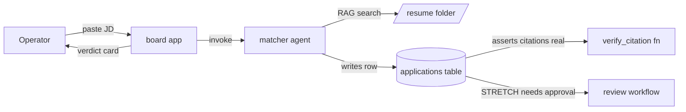

# Shortlist

**A job-application command centre that decides and proves.**

Paste a job description. Shortlist returns a **verdict** (STRONG FIT / STRETCH / SKIP), quotes the
JD requirements next to the verbatim resume lines that **prove** them, lists the **gaps** you are
missing, and drafts a **tailored intro message**. STRETCH roles wait in a review queue for your
approval before you apply.

It does not just track applications. Every claimed match cites a real line from your resume, so
"did the model hallucinate?" is answered with one click. A `verify_citation` check enforces it:
the matcher may only quote evidence it copied verbatim from a resume search hit.

Production app: **https://shortlist-board.apps.lemma.work**

---

## How it works



1. The **board** app takes a Company, Role, and Job Description.
2. The **matcher** agent searches the resume (built-in RAG over `/resume`), scores fit 1 to 5,
   and writes a structured verdict into the **applications** table.
3. **verify_citation** asserts every quoted resume line actually exists, flipping a `verified` flag.
4. STRETCH verdicts route through the **review** workflow for human approval before they move to Applied.

The matcher's scoring rubric, CV-match logic, and legitimacy signals are ported from a
job-evaluation system tuned over 700+ real evaluations.

---

## Repository layout

```
.
├── shortlist/            # PRODUCTION: the Lemma pod bundle (deployed)
│   ├── pod.json
│   ├── agents/matcher/           # the engine: scores fit, writes verdict
│   ├── functions/verify_citation/# asserts every cited resume line is real
│   ├── tables/applications/      # one row per evaluated job
│   ├── workflows/review/         # human approval for STRETCH roles
│   ├── apps/board/               # the operator UI (static HTML/CSS/JS)
│   ├── files/resume/             # cv.md lives here, auto-indexed
│   ├── README.md                 # pod overview
│   └── AGENTS.md                 # how to build/import the pod
│
├── local-prototype/      # the original FastAPI version (pre-Lemma, kept for local dev)
│   ├── main.py                   # FastAPI server + local JSON file store
│   ├── index.html / dashboard.html / login.html
│   ├── css/ js/                  # frontend wired to /api/*
│   └── jd_1..3.txt               # sample job descriptions
│
├── docs/                 # ARCHITECTURE, PROJECT_STATUS, plan, progress
└── README.md             # you are here
```

`shortlist/` is the real product. `local-prototype/` is the v0 that ran on a local FastAPI
backend before the system moved onto the Lemma platform; it is self-contained and still runs.

---

## Quickstart

### Production pod (Lemma)

The pod bundle is plain files imported with the `lemma` CLI. The bundle is the source of truth:
edit files, then re-import.

```bash
lemma pods import ./shortlist --dry-run     # validate every resource + grant, write nothing
lemma pods import ./shortlist               # upsert by resource name
lemma files upload ./shortlist/files/cv.md /resume/cv.md   # resume is not bundled; upload after import
lemma apps deploy board
```

Verify the engine end to end:

```bash
lemma agents chat matcher "<paste a job description>"
# expect a verdict whose proof[].resume_evidence strings appear verbatim in cv.md
```

See `shortlist/AGENTS.md` for import order, grants, and the cite-or-abstain rule the product depends on.

### Local prototype (FastAPI)

Self-contained, no Lemma account needed. Paths are relative to the working directory, so run it
from inside its own folder:

```bash
cd local-prototype
pip install fastapi uvicorn pydantic python-multipart
python3 main.py
# open http://127.0.0.1:8000
```

User data (credentials, resumes, applications) is written to a local `data/` directory and is
gitignored. Email verification codes are printed to the terminal and written to
`data/last_verification_code.txt`. Full details in `docs/ARCHITECTURE.md`.

---

## Documentation

| Doc | What's in it |
|---|---|
| `shortlist/README.md` | What the pod is and the resources inside it |
| `shortlist/AGENTS.md` | How to build, import, and deploy the pod |
| `docs/ARCHITECTURE.md` | System design of the local FastAPI prototype |
| `docs/PROJECT_STATUS.md` | Version history and operational notes |
